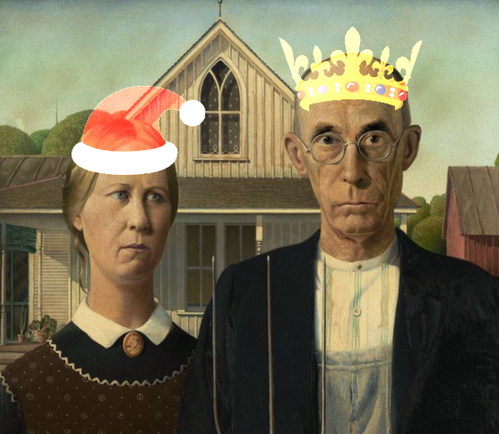

# Lotsohats
Deface your image or stream of images with cephalic accessories.  To validate my experience watching [Ron Evans'](https://github.com/deadprogram) [introduction to computer vision with Go](https://www.safaribooksonline.com/live-training/courses/getting-started-with-computer-vision-using-go/0636920199427/), I hacked up this project to drop icons on top of faces in images and webcams.

## How to run


Download any neural network classifier [readable by GoCV](https://godoc.org/gocv.io/x/gocv#ReadNet) to detect faces, e.g. Caffe or TensorFlow, or some other image feature.

```bash
cd data
wget https://github.com/opencv/opencv_3rdparty/raw/dnn_samples_face_detector_20170830/res10_300x300_ssd_iter_140000.caffemodel
wget https://raw.githubusercontent.com/opencv/opencv/master/samples/dnn/face_detector/deploy.prototxt
```

Identify an image to place on top of your detected features.  The image format must be one readable by OpenCV, e.g. png or jpeg.  The portion of the image representing the background must be black.  OpenCV image addition does not reliably handle png transparency.

Create a JSON configuration file resembling the following
```json
{
  "HatFilenames" : ["santa.png", "crown.png"],
  "ClassifierModelFilename" : "res10_300x300_ssd_iter_140000.caffemodel",
  "ClassifierNetworkFilename" : "deploy.proto",
  "ScaleX": [1.35],
  "TranslateXPct" : [0.15, 0.0], 
  "TranslateYPct" : [0.75],
}
```

The second argument to the program specifies either a static image (using a file name) or a webcam (using the integer id-- 0 on most laptop and desktops).  Run as followed

```bash
go run main.go data/multi.json data/gothic.png 
```

or

```bash
go run main.go data/multi.json 0
```

and type any key in the window to quit.

### Optional Configuration Parameters
The `ScaleX` parameter allows scaling of the hat image to be wider (or narrower) than identified face regions.  

Values of `TranslateXPct` shift the hat on the face right (for positive values) or left, useful when the hat is not symetric.  `TranslateYPct` values shift the hat image up towards the top of the face region.
